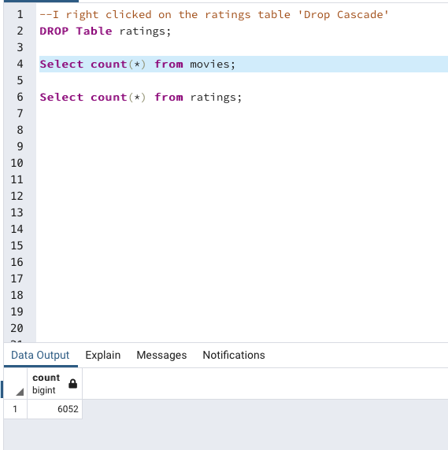

# Movies-ETL

## Purpose of the Analysis
Develop an algorithm to predict which low-budget movies released will become popular, so Amazing the world's largest online retailer can buy the streaming rights at a very low price. With this data Amazing can make a business decision such as, drive up their number of subscribers or find popular if there is genre popularity by yearly seasons.

#### Movies Query

#### Ratings Query

